# 如何使用 Vitepress + Github Pages 部署你的项目文档

## 必要前置条件

安装了 [Node](https://nodejs.org/zh-cn) ，并拥有 Github 账号 

## 同时你还需要

安装 [Visual Studio Code](https://code.visualstudio.com/Download) ，这是一款功能强大的轻量级源代码编辑器；
安装 [Git](https://git-scm.com/downloads) 以方便你日后将创作的内容推送到远程仓库。

# 第一步：部署 vitepress

首先创建一个文件夹用来在本地存放 vitepress 项目

在 `Powershell` 或其他终端中选定一个盘符并创建项目文件夹，如：

```shell
cd D:\ && mkdir vitedoc && cd vitedoc  
```

这时你已经定位到了项目文件夹内。

然后，安装 vitepress ：

```shell
npm add -D vitepress
```

如果遇到安装卡顿或超时报错，可尝试更换为淘宝镜像源：
::: code-group
```shell [npm]

npm config set registry https://registry.npmmirror.com

```
```shell [yarn]

yarn config set registry https://registry.npmmirror.com

```

:::

正常情况下，日志应该是这样的：
```shell
PS G:\vitedoc> npm add -D vitepress

added 125 packages in 15s

38 packages are looking for funding
  run `npm fund` for details
```

接下来启动 vitepress 安装向导（npm）：

```shell
npx vitepress init
```

在这一过程中你需要回答一些简单的问题：
**推荐根据下面的设置来。**

```shell
┌  Welcome to VitePress!
│
◇  Where should VitePress initialize the config?  //VitePress 应该在哪里初始化配置？
│  ./docs
│
◇  Site title:   //站点标题
│  My Awesome Project
│
◇  Site description:  //站点描述
│  A VitePress Site
│
◇  Theme:  //主题
│  Default Theme
│
◇  Use TypeScript for config and theme files?  //使用 TypeScript 来设置配置文件和主题文件？
│  Yes
│
◇  Add VitePress npm scripts to package.json?  //在 package.json 里加入 vitepress 的 npm 启动文件？
│  Yes
│
◇  Add a prefix for VitePress npm scripts?  //为 VitePress npm 脚本添加前缀？
│  Yes
│
◇  Prefix for VitePress npm scripts:  //输入前缀
│  docs
│
└  Done! Now run pnpm run docs:dev and start writing.  //在控制台输入 npm run docs:dev 以运行 vitepress 。
```
<hr> 

现在在终端输入 npm run docs:dev ，你应该看到：  

```shell
  vitepress v1.6.3

  ➜  Local:   http://localhost:5173/
  ➜  Network: use --host to expose
  ➜  press h to show help
```

在浏览器输入 `http://localhost:5173/` 或直接按住 `Ctrl` 单击链接（如果你使用的是 [Windows Terminal](https://apps.microsoft.com/detail/9n0dx20hk701?launch=true&mode=full&hl=zh-cn&gl=cn&ocid=bingwebsearch) 的话）

你应该会看到这样一个站点：


恭喜你，完成了第一步。

# 第二步：在 Github 创建并配置远程仓库

打开 [Github](https://github.com) , 登录你的 Github 账号并按左上角的 `New` 新建一个仓库：
  
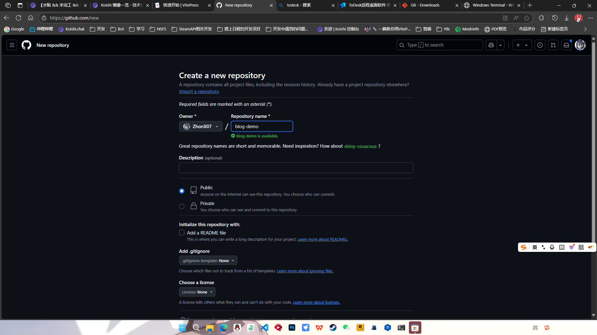

**请勿勾选 `Add a README file` 和 `Add .gitignore` 。**

现在你就有了一个名为 `doc-demo` 的仓库。

现在回到终端。

**在确保自己已经安装了 Git 的情况下，**

设置 git 的用户名与邮箱，当然最好要是你在注册 github 时所填入的，虽然不一致也可以。

:::details 不一致会有哪些问题呢？
**如果不一致**，GitHub 还是能接收代码，但显示为“匿名提交”，你就拿不到绿点贡献记录。
:::

如：
```git
$ git config --global user.name "你的用户名"       <--记得改！别直接复制粘贴！
$ git config --global user.email "你的邮箱地址"   <- ┚
```
好了，接下来配置 ssh 密钥。
按下 `Win+R` ，输入 `Git` ，选择 `Git Bash`。

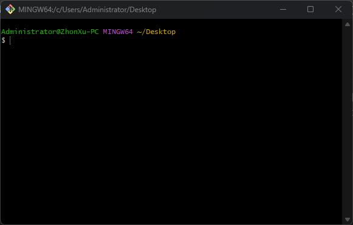

输入 `ssh-keygen -t rsa` 并敲三下回车。

:::details 为什么敲三下回车？
因为输入这个命令生成密钥时，会有提示问你是否需要设置密码，如果设置了话，每次使用 Git 都会用到密码，一般都是直接不写为空，直接回车就好。
:::

然后，输入 `cat ~/.ssh/id_rsa.pub`  查看密钥。

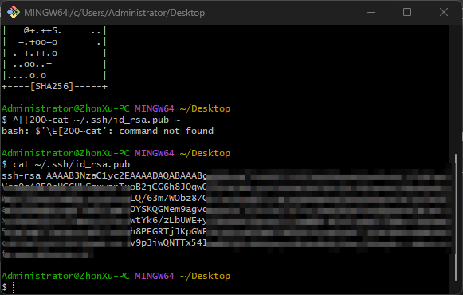

密钥复制备用， ~~待会下锅。~~ 

打开 [你的 Github 密钥配置界面](https://github.com/settings/keys)


点击 `New SSH key` ，将你的密钥输入进去并起一个 title 。

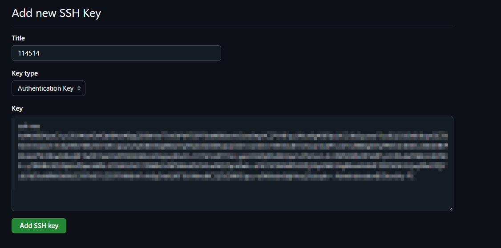

## 无论何时……

### **不要将你的 KEY 分享给他人！<br>不要将你的 KEY 分享给他人！<br>不要将你的 KEY 分享给他人！**


自己的家门钥匙要自己守好，**钥匙都满天飞了还只想着锁门，你靠空气防盗？**


:::details 如果不慎泄露了 KEY ？
立刻！马上！按下右边的 **Delete** 按钮删掉它！

:::

好，现在远程仓库完事了，接下来配置本地仓库。

# 第三步：配置本地仓库
在接下来的步骤中，为了方便，我们在 VSCode 里用终端操作。

首先 在 VSCode 里安装简体中文语言包，详情请参阅：[VScode：将VScode界面的显示语言改为简体中文，切换VScode界面的显示语言](https://doc.csdn.net/mighty13/article/details/114420578)

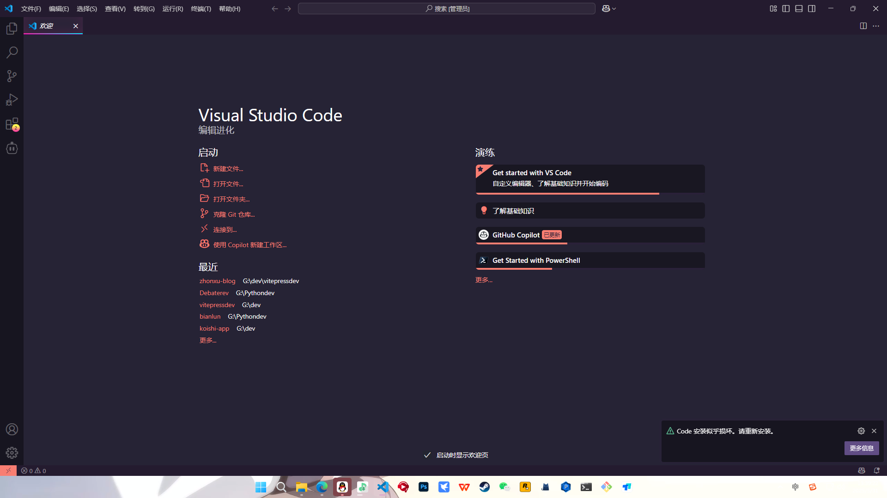

我们选择打开文件夹，找到并在 VSCode 打开你设置的 vitepress 项目目录。

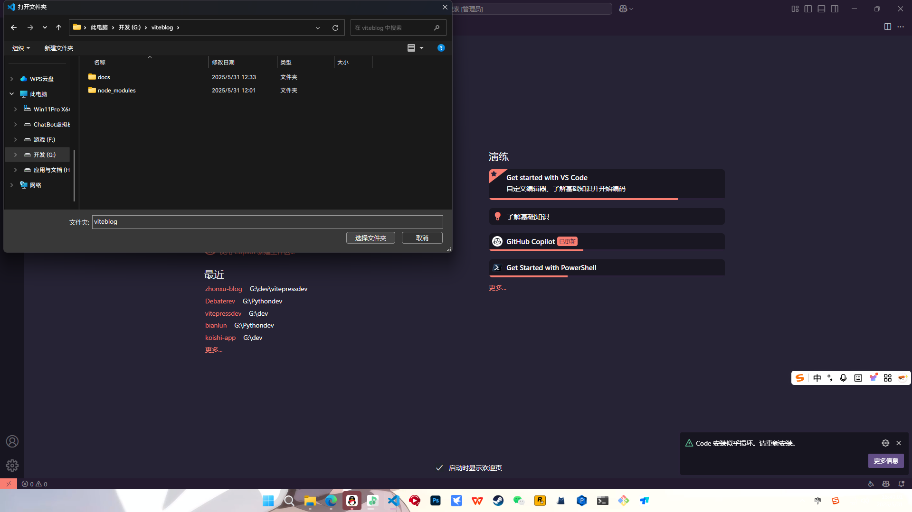

按下 `Ctrl+J` 打开 `“终端”` , 输入：

```git
git init
git branch -M main
```
这两步分别 创建了一个本地仓库 并 重命名本地分支为 main 。

:::details 不理解为什么要重命名分支？
Github 中，项目的默认分支为 main，但 git 创建的本地分支默认为 master，如果不加重命名就提交，会导致下面的报错：
```shell
error: src refspec main does not match any
error: failed to push some refs to 'https://github.com/<你的用户名>/<你的仓库名>.git'

```
:::

**接下来， 添加远程仓库。**

回到你的仓库页，它应该是这样的：

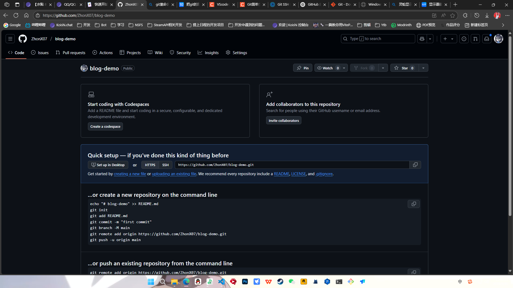

现在点击 `SSH` ，复制右边的形如

```link
git@github.com:<你的用户名>/<你的仓库名>.git
```

的地址。

接下来继续在终端输入：

```shell
git remote add origin <↑上面的地址>
```

:::details 可以在什么时候添加仓库？
init 之后， push 之前添加都可以，但考虑到可能会有人急着提交忘记添加仓库，故越早越好。
:::

接下来你可以用 VSCode 编写自己的作品，先试着修改 `markdown-examples.md` 和 `api-examples.md` 这两个初始页面。

别忘了再次使用 `npm run docs:dev` 来启动 vitepress 。

如果你还不熟悉 Markdown 语法，请参阅 [Markdown 教程](https://markdown.com.cn)

**配置 vitepress 不属于本篇内容范畴，请自行STFW。**

# 第四步：提交到 Github 并启用 Github Actions

我们先回到项目仓库页。
点击 `Settings` -> 右边栏的 `Pages` -> `Source/Github Actions` 。

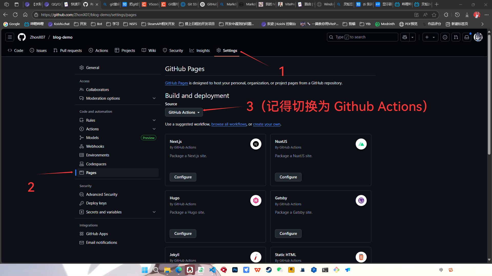

接下来回到 VSCode 。

找到 `config.mts`，打开：

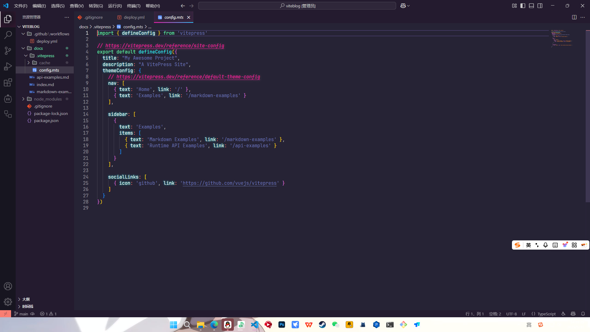


在第二行添加：

```typescript
const base = "/doc-demo/";      // doc-demo 改成你仓库的名字
```

再添加一行：

```
export default defineConfig({
  base, //添加这一行
  title: "My Awesome Project",
  description: "A VitePress Site",
  themeConfig: {
    // https://vitepress.dev/reference/default-theme-config
    nav: [
      { text: 'Home', link: '/' },
      { text: 'Examples', link: '/markdown-examples' }
    ],
    //其它代码
```

既然选择了使用 Github Actions ，那我们就需要写一份工作流文件。

你可以自行 Google 搜索教程，也可以照抄这份文件：

```
name: Deploy Pages

# 触发条件，push到main分支或者pull request到main分支
on:
  push:
    branches: [main]
  pull_request:
    branches: [main]

  # 支持手动在工作流上触发
  workflow_dispatch:

# 设置时区
env:
  TZ: Asia/Shanghai

# 权限设置
permissions:
  # 允许读取仓库内容的权限。
  contents: read
  # 允许写入 GitHub Pages 的权限。
  pages: write
  # 允许写入 id-token 的权限。
  id-token: write

# 并发控制配置
concurrency:
  group: pages
  cancel-in-progress: false

# 定义执行任务
jobs:
  # 构建任务
  build:

    runs-on: ubuntu-latest

    # node v20 运行
    strategy:
      matrix:
        node-version: [20]

    steps:
      # 拉取代码
      - name: Checkout
        uses: actions/checkout@v3
        with:
          # 保留 Git 信息
          fetch-depth: 0

      # 设置使用 Node.js 版本
      - name: Use Node.js ${{ matrix.node-version }}
        uses: actions/setup-node@v3
        with:
          node-version: ${{ matrix.node-version }}

      # 使用 最新的 PNPM
      # 你也可以指定为具体的版本
      - uses: pnpm/action-setup@v2
        name: Install pnpm
        with:
          version: latest
          # version: 9
          run_install: false

        # 安装依赖
      - name: Install dependencies
        run: pnpm install

        # 构建项目
      - name: Build doc project
        run: |
          echo ${{ github.workspace }}
          pnpm docs:build

        # 资源拷贝
      - name: Build with Jekyll
        uses: actions/jekyll-build-pages@v1
        with:
          source: ./docs/.vitepress/dist
          destination: ./_site

        # 上传 _site 的资源，用于后续部署
      - name: Upload artifact
        uses: actions/upload-pages-artifact@v3

  # 部署任务
  deploy:
    environment:
      name: github-pages
      url: ${{ steps.deployment.outputs.page_url }}
    runs-on: ubuntu-latest
    needs: build
    steps:
      - name: Deploy to GitHub Pages
        id: deployment
        uses: actions/deploy-pages@v4
```

也不要忘了 `.gitignore` 文件：

```
node_modules
dist
cache
.temp
.DS_Store
```

**记住，`.gitignore` 文件要放在项目根目录。**
接着在底部面板切换到终端，输入以下指令：
```shell
git add .
git commit -m "初次提交"
git push origin main
```
回到你的仓库地址，刷新一下，你应该能看到一个黄点，这代表 Github Actions 正在运行，可以查看详细信息。

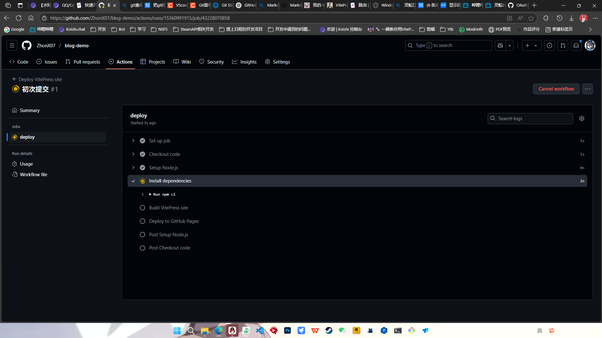

如果一切顺利，你应该看到的界面如下：

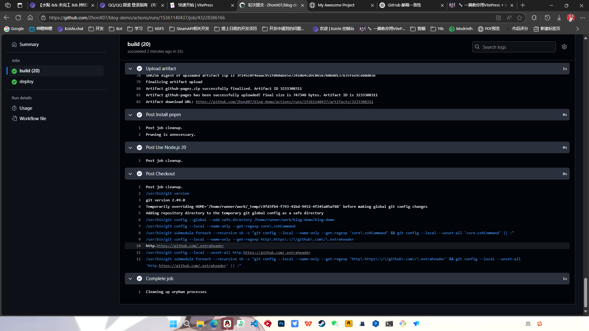

这个时候尝试访问
```url
https://你的Github用户名.github.io/你的仓库名/
```
应该能够正常显示。

